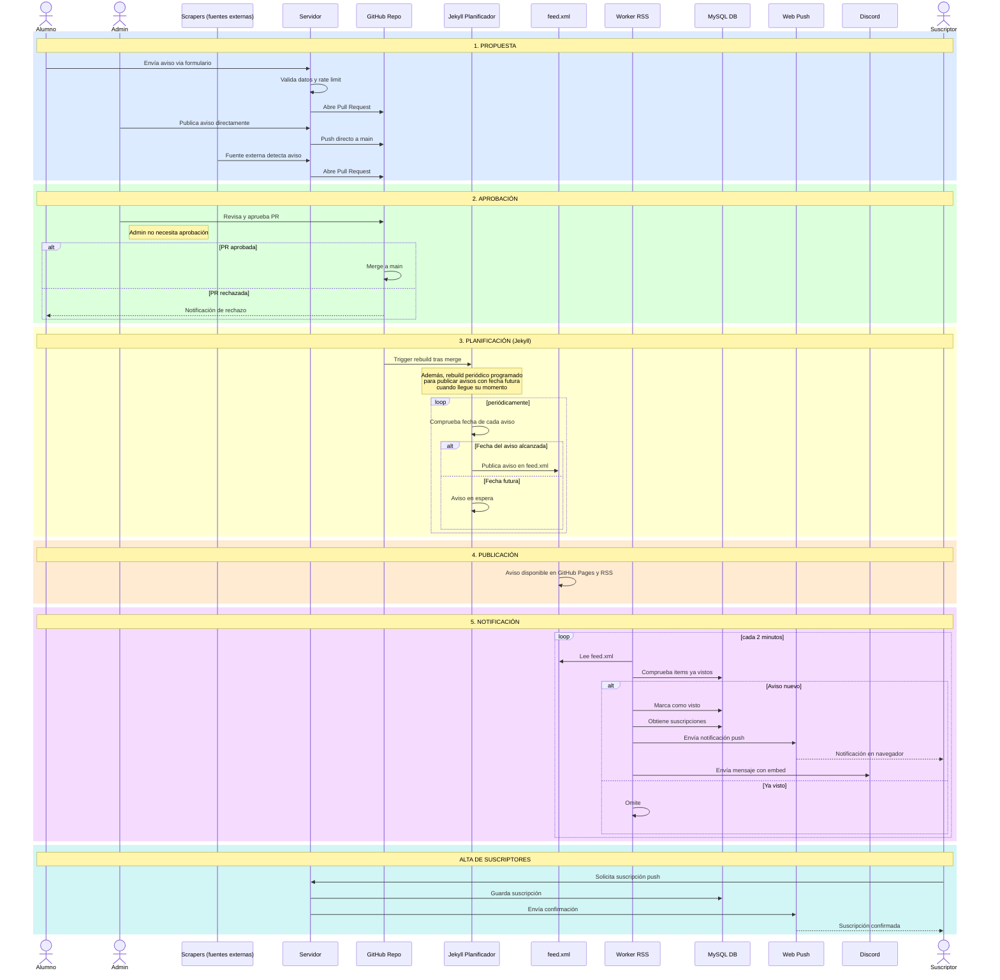

De ahora en adelante se publicarán aquí las últimas novedades de interés, debido al exceso de publicaciones en el grupo.

También estarán disponibles como feed RSS, por lo que se pueden recibir los mensajes desde clientes como Thunderbird, apps móviles (como Feeder), bots de Telegram (p.ej. @FeedRiverBot, con el comando `/add https://ggelado.github.io/avisos5S2M-B/feed.xml`)...

**Se recomienda configurar las notificaciones push [desde aquí](https://notifierpushrss.onrender.com/).**

Los avisos cuentan con categorías XML, que puede utilizar para filtrar si su cliente RSS lo permite.

Si se utiliza el cliente Feeder, se recomienda configurar las notificaciones y una frecuencia de refresco suficientemente alta, se recomienda 15 minutos.

Recuerda que si un post se modifica, su cliente RSS podría no reflejar los cambios. Por ello se recomienda que aquellos avisos que puedan estar sujetos a cambios regulares (como pueden ser las convocatorias de examen) se revisen accediendo al enlace del aviso y/o Moodle de las asignaturas.

**INCLUSO HAY UN BOT DE DISCORD QUE PUEDES AGREGAR A TU SERVIDOR [PULSANDO AQUÍ](https://discord.com/oauth2/authorize?client_id=1464244457049424079&permissions=2048&integration_type=0&scope=bot)**

¿Todavía no te parece suficiente? Puedes incluso agregar los distintos avisos a tu calendario. Simplemente accede a tu proveedor de calendario (p.ej. google calendar), agregar calendario por url e indica `https://ggelado.github.io/avisos5S2M-B/avisos.ics`

[Agregar a Google Calendar](https://calendar.google.com/calendar/r?cid=webcal%3A%2F%2Fggelado.github.io%2Favisos5S2M-B%2Favisos.ics).
[Agregar a Apple Calendar](webcal://ggelado.github.io/avisos5S2M-B/avisos.ics). (no tengo dispositivos de apple, si no va el link me decís)

---

La web está creada por alumnos y para alumnos. Bastantes cosas están muy chapuceras, lo reconocemos, pero por ello el código es público y está abierto a Pull Requests, por lo que animamos a todo el mundo a contribuir con lo que pueda, desde diseño gráfico (de ahí los logos tan cutres, era un requisito de Google para poder configurarla como web-app) hasta la lógica de negocio.

[Contribuir](https://github.com/ggelado/avisos5S2M-B/fork)

Y si encuentras alguna vulnerabilidad de seguridad, por favor, indícanoslo a través de la pestaña [Security](https://github.com/ggelado/avisos5S2M-B/security/advisories/new) del repositorio o por los medios cifrados de contacto [disponibles aquí](https://ggelado.github.io/avisos5S2M-B/SECURITY). Por favor, insistimos en utilizar estos medios y no cualquier otro cuando se traten de vulnerabilidades o problemas de seguridad.

---

# ¿Cómo funciona? (POST EN REDACCIÓN)

