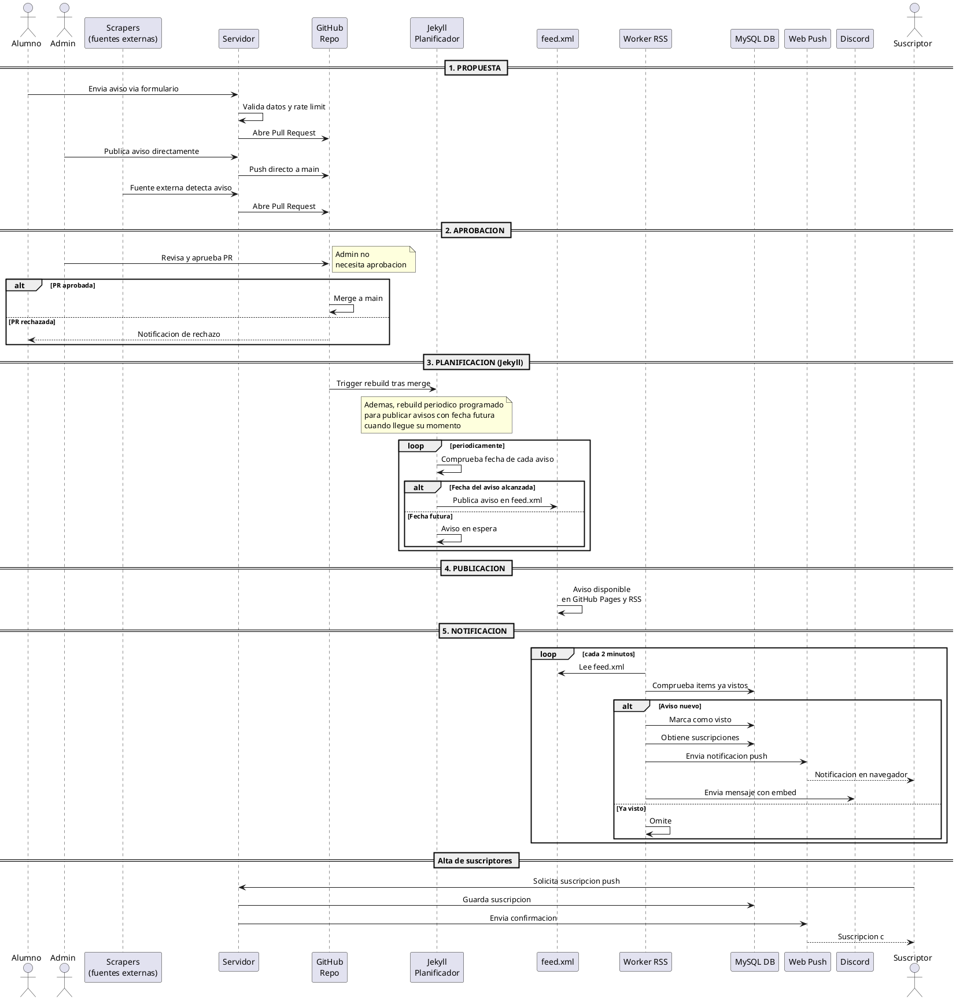

De ahora en adelante se publicarán aquí las últimas novedades de interés, debido al exceso de publicaciones en el grupo.

También estarán disponibles como feed RSS, por lo que se pueden recibir los mensajes desde clientes como Thunderbird, apps móviles (como Feeder), bots de Telegram (p.ej. @FeedRiverBot, con el comando `/add https://ggelado.github.io/avisos5S2M-B/feed.xml`)...

**Se recomienda configurar las notificaciones push [desde aquí](https://notifierpushrss.onrender.com/).**

Los avisos cuentan con categorías XML, que puede utilizar para filtrar si su cliente RSS lo permite.

Si se utiliza el cliente Feeder, se recomienda configurar las notificaciones y una frecuencia de refresco suficientemente alta, se recomienda 15 minutos.

Recuerda que si un post se modifica, su cliente RSS podría no reflejar los cambios. Por ello se recomienda que aquellos avisos que puedan estar sujetos a cambios regulares (como pueden ser las convocatorias de examen) se revisen accediendo al enlace del aviso y/o Moodle de las asignaturas.

**INCLUSO HAY UN BOT DE DISCORD QUE PUEDES AGREGAR A TU SERVIDOR [PULSANDO AQUÍ](https://discord.com/oauth2/authorize?client_id=1464244457049424079&permissions=2048&integration_type=0&scope=bot)**

¿Todavía no te parece suficiente? Puedes incluso agregar los distintos avisos a tu calendario. Simplemente accede a tu proveedor de calendario (p.ej. google calendar), agregar calendario por url e indica `https://ggelado.github.io/avisos5S2M-B/avisos.ics`

[Agregar a Google Calendar](https://calendar.google.com/calendar/r?cid=webcal%3A%2F%2Fggelado.github.io%2Favisos5S2M-B%2Favisos.ics).
[Agregar a Apple Calendar](webcal://ggelado.github.io/avisos5S2M-B/avisos.ics). (no tengo dispositivos de apple, si no va el link me decís)

---

La web está creada por alumnos y para alumnos. Bastantes cosas están muy chapuceras, lo reconocemos, pero por ello el código es público y está abierto a Pull Requests, por lo que animamos a todo el mundo a contribuir con lo que pueda, desde diseño gráfico (de ahí los logos tan cutres, era un requisito de Google para poder configurarla como web-app) hasta la lógica de negocio.

[Contribuir](https://github.com/ggelado/avisos5S2M-B/fork)

Y si encuentras alguna vulnerabilidad de seguridad, por favor, indícanoslo a través de la pestaña [Security](https://github.com/ggelado/avisos5S2M-B/security/advisories/new) del repositorio o por los medios cifrados de contacto [disponibles aquí](https://ggelado.github.io/avisos5S2M-B/SECURITY). Por favor, insistimos en utilizar estos medios y no cualquier otro cuando se traten de vulnerabilidades o problemas de seguridad.

---

# ¿Cómo funciona? (POST EN REDACCIÓN)

<svg xmlns="http://www.w3.org/2000/svg" xmlns:xlink="http://www.w3.org/1999/xlink" contentStyleType="text/css" data-diagram-type="SEQUENCE" height="1607px" preserveAspectRatio="none" style="width:1757px;height:1607px;background:#FFFFFF;" version="1.1" viewBox="0 0 1757 1607" width="1757px" zoomAndPan="magnify"><defs/><g><rect fill="none" height="103.2031" style="stroke:#000000;stroke-width:1.5;" width="705.4878" x="10" y="451.7578"/><rect fill="none" height="176.4688" style="stroke:#000000;stroke-width:1.5;" width="349.4243" x="734.8667" y="706.625"/><rect fill="none" height="103.2031" style="stroke:#000000;stroke-width:1.5;" width="329.4243" x="744.8667" y="772.8906"/><rect fill="none" height="309.1328" style="stroke:#000000;stroke-width:1.5;" width="761.8218" x="978.9863" y="1040.625"/><rect fill="none" height="219.7344" style="stroke:#000000;stroke-width:1.5;" width="598.5908" x="1132.2173" y="1123.0234"/><g class="participant-lifeline" data-entity-uid="part1" data-qualified-name="Alumno" id="part1-lifeline"><g><title>Alumno</title><rect fill="#000000" fill-opacity="0.00000" height="1445.125" width="8" x="45.708" y="81.2969"/><line style="stroke:#181818;stroke-width:0.5;stroke-dasharray:5,5;" x1="49" x2="49" y1="81.2969" y2="1526.4219"/></g></g><g class="participant-lifeline" data-entity-uid="part2" data-qualified-name="Admin" id="part2-lifeline"><g><title>Admin</title><rect fill="#000000" fill-opacity="0.00000" height="1445.125" width="8" x="110.8481" y="81.2969"/><line style="stroke:#181818;stroke-width:0.5;stroke-dasharray:5,5;" x1="114.416" x2="114.416" y1="81.2969" y2="1526.4219"/></g></g><g class="participant-lifeline" data-entity-uid="part3" data-qualified-name="Scraper" id="part3-lifeline"><g><title>Scrapers</title><rect fill="#000000" fill-opacity="0.00000" height="1445.125" width="8" x="218.061" y="81.2969"/><line style="stroke:#181818;stroke-width:0.5;stroke-dasharray:5,5;" x1="221.2803" x2="221.2803" y1="81.2969" y2="1526.4219"/></g></g><g class="participant-lifeline" data-entity-uid="part4" data-qualified-name="Servidor" id="part4-lifeline"><g><title>Servidor</title><rect fill="#000000" fill-opacity="0.00000" height="1445.125" width="8" x="433.3984" y="81.2969"/><line style="stroke:#181818;stroke-width:0.5;stroke-dasharray:5,5;" x1="437.0791" x2="437.0791" y1="81.2969" y2="1526.4219"/></g></g><g class="participant-lifeline" data-entity-uid="part5" data-qualified-name="GitHub" id="part5-lifeline"><g><title>GitHub</title><rect fill="#000000" fill-opacity="0.00000" height="1445.125" width="8" x="602.9668" y="81.2969"/><line style="stroke:#181818;stroke-width:0.5;stroke-dasharray:5,5;" x1="606.7095" x2="606.7095" y1="81.2969" y2="1526.4219"/></g></g><g class="participant-lifeline" data-entity-uid="part6" data-qualified-name="Jekyll" id="part6-lifeline"><g><title>Jekyll</title><rect fill="#000000" fill-opacity="0.00000" height="1445.125" width="8" x="798.855" y="81.2969"/><line style="stroke:#181818;stroke-width:0.5;stroke-dasharray:5,5;" x1="801.8667" x2="801.8667" y1="81.2969" y2="1526.4219"/></g></g><g class="participant-lifeline" data-entity-uid="part7" data-qualified-name="Feed" id="part7-lifeline"><g><title>feed.xml</title><rect fill="#000000" fill-opacity="0.00000" height="1445.125" width="8" x="1022.6387" y="81.2969"/><line style="stroke:#181818;stroke-width:0.5;stroke-dasharray:5,5;" x1="1025.9863" x2="1025.9863" y1="81.2969" y2="1526.4219"/></g></g><g class="participant-lifeline" data-entity-uid="part8" data-qualified-name="Worker" id="part8-lifeline"><g><title>Worker RSS</title><rect fill="#000000" fill-opacity="0.00000" height="1445.125" width="8" x="1186.5132" y="81.2969"/><line style="stroke:#181818;stroke-width:0.5;stroke-dasharray:5,5;" x1="1190.2173" x2="1190.2173" y1="81.2969" y2="1526.4219"/></g></g><g class="participant-lifeline" data-entity-uid="part9" data-qualified-name="DB" id="part9-lifeline"><g><title>MySQL DB</title><rect fill="#000000" fill-opacity="0.00000" height="1445.125" width="8" x="1388.3618" y="81.2969"/><line style="stroke:#181818;stroke-width:0.5;stroke-dasharray:5,5;" x1="1391.9092" x2="1391.9092" y1="81.2969" y2="1526.4219"/></g></g><g class="participant-lifeline" data-entity-uid="part10" data-qualified-name="Push" id="part10-lifeline"><g><title>Web Push</title><rect fill="#000000" fill-opacity="0.00000" height="1445.125" width="8" x="1483.4521" y="81.2969"/><line style="stroke:#181818;stroke-width:0.5;stroke-dasharray:5,5;" x1="1486.8145" x2="1486.8145" y1="81.2969" y2="1526.4219"/></g></g><g class="participant-lifeline" data-entity-uid="part11" data-qualified-name="Discord" id="part11-lifeline"><g><title>Discord</title><rect fill="#000000" fill-opacity="0.00000" height="1445.125" width="8" x="1568.5244" y="81.2969"/><line style="stroke:#181818;stroke-width:0.5;stroke-dasharray:5,5;" x1="1572.0898" x2="1572.0898" y1="81.2969" y2="1526.4219"/></g></g><g class="participant-lifeline" data-entity-uid="part12" data-qualified-name="Suscriptor" id="part12-lifeline"><g><title>Suscriptor</title><rect fill="#000000" fill-opacity="0.00000" height="1445.125" width="8" x="1678.2612" y="81.2969"/><line style="stroke:#181818;stroke-width:0.5;stroke-dasharray:5,5;" x1="1681.7144" x2="1681.7144" y1="81.2969" y2="1526.4219"/></g></g><g class="participant participant-head" data-entity-uid="part1" data-qualified-name="Alumno" id="part1-head"><text fill="#000000" font-family="sans-serif" font-size="14" lengthAdjust="spacing" textLength="53.416" x="20" y="77.9951">Alumno</text><ellipse cx="49.708" cy="13.5" fill="#E2E2F0" rx="8" ry="8" style="stroke:#181818;stroke-width:0.5;"/><path d="M49.708,21.5 L49.708,48.5 M36.708,29.5 L62.708,29.5 M49.708,48.5 L36.708,63.5 M49.708,48.5 L62.708,63.5" fill="none" style="stroke:#181818;stroke-width:0.5;"/></g><g class="participant participant-tail" data-entity-uid="part1" data-qualified-name="Alumno" id="part1-tail"><text fill="#000000" font-family="sans-serif" font-size="14" lengthAdjust="spacing" textLength="53.416" x="20" y="1538.417">Alumno</text><ellipse cx="49.708" cy="1550.2188" fill="#E2E2F0" rx="8" ry="8" style="stroke:#181818;stroke-width:0.5;"/><path d="M49.708,1558.2188 L49.708,1585.2188 M36.708,1566.2188 L62.708,1566.2188 M49.708,1585.2188 L36.708,1600.2188 M49.708,1585.2188 L62.708,1600.2188" fill="none" style="stroke:#181818;stroke-width:0.5;"/></g><g class="participant participant-head" data-entity-uid="part2" data-qualified-name="Admin" id="part2-head"><text fill="#000000" font-family="sans-serif" font-size="14" lengthAdjust="spacing" textLength="44.8643" x="89.416" y="77.9951">Admin</text><ellipse cx="114.8481" cy="13.5" fill="#E2E2F0" rx="8" ry="8" style="stroke:#181818;stroke-width:0.5;"/><path d="M114.8481,21.5 L114.8481,48.5 M101.8481,29.5 L127.8481,29.5 M114.8481,48.5 L101.8481,63.5 M114.8481,48.5 L127.8481,63.5" fill="none" style="stroke:#181818;stroke-width:0.5;"/></g><g class="participant participant-tail" data-entity-uid="part2" data-qualified-name="Admin" id="part2-tail"><text fill="#000000" font-family="sans-serif" font-size="14" lengthAdjust="spacing" textLength="44.8643" x="89.416" y="1538.417">Admin</text><ellipse cx="114.8481" cy="1550.2188" fill="#E2E2F0" rx="8" ry="8" style="stroke:#181818;stroke-width:0.5;"/><path d="M114.8481,1558.2188 L114.8481,1585.2188 M101.8481,1566.2188 L127.8481,1566.2188 M114.8481,1585.2188 L101.8481,1600.2188 M114.8481,1585.2188 L127.8481,1600.2188" fill="none" style="stroke:#181818;stroke-width:0.5;"/></g><g class="participant participant-head" data-entity-uid="part3" data-qualified-name="Scraper" id="part3-head"><rect fill="#E2E2F0" height="46.5938" rx="2.5" ry="2.5" style="stroke:#181818;stroke-width:0.5;" width="143.5615" x="150.2803" y="33.7031"/><text fill="#000000" font-family="sans-serif" font-size="14" lengthAdjust="spacing" textLength="61.4688" x="191.3267" y="53.6982">Scrapers</text><text fill="#000000" font-family="sans-serif" font-size="14" lengthAdjust="spacing" textLength="129.5615" x="157.2803" y="69.9951">(fuentes externas)</text></g><g class="participant participant-tail" data-entity-uid="part3" data-qualified-name="Scraper" id="part3-tail"><rect fill="#E2E2F0" height="46.5938" rx="2.5" ry="2.5" style="stroke:#181818;stroke-width:0.5;" width="143.5615" x="150.2803" y="1525.4219"/><text fill="#000000" font-family="sans-serif" font-size="14" lengthAdjust="spacing" textLength="61.4688" x="191.3267" y="1545.417">Scrapers</text><text fill="#000000" font-family="sans-serif" font-size="14" lengthAdjust="spacing" textLength="129.5615" x="157.2803" y="1561.7139">(fuentes externas)</text></g><g class="participant participant-head" data-entity-uid="part4" data-qualified-name="Servidor" id="part4-head"><rect fill="#E2E2F0" height="30.2969" rx="2.5" ry="2.5" style="stroke:#181818;stroke-width:0.5;" width="72.6387" x="401.0791" y="50"/><text fill="#000000" font-family="sans-serif" font-size="14" lengthAdjust="spacing" textLength="58.6387" x="408.0791" y="69.9951">Servidor</text></g><g class="participant participant-tail" data-entity-uid="part4" data-qualified-name="Servidor" id="part4-tail"><rect fill="#E2E2F0" height="30.2969" rx="2.5" ry="2.5" style="stroke:#181818;stroke-width:0.5;" width="72.6387" x="401.0791" y="1525.4219"/><text fill="#000000" font-family="sans-serif" font-size="14" lengthAdjust="spacing" textLength="58.6387" x="408.0791" y="1545.417">Servidor</text></g><g class="participant participant-head" data-entity-uid="part5" data-qualified-name="GitHub" id="part5-head"><rect fill="#E2E2F0" height="46.5938" rx="2.5" ry="2.5" style="stroke:#181818;stroke-width:0.5;" width="62.5146" x="575.7095" y="33.7031"/><text fill="#000000" font-family="sans-serif" font-size="14" lengthAdjust="spacing" textLength="48.5146" x="582.7095" y="53.6982">GitHub</text><text fill="#000000" font-family="sans-serif" font-size="14" lengthAdjust="spacing" textLength="35.793" x="589.0703" y="69.9951">Repo</text></g><g class="participant participant-tail" data-entity-uid="part5" data-qualified-name="GitHub" id="part5-tail"><rect fill="#E2E2F0" height="46.5938" rx="2.5" ry="2.5" style="stroke:#181818;stroke-width:0.5;" width="62.5146" x="575.7095" y="1525.4219"/><text fill="#000000" font-family="sans-serif" font-size="14" lengthAdjust="spacing" textLength="48.5146" x="582.7095" y="1545.417">GitHub</text><text fill="#000000" font-family="sans-serif" font-size="14" lengthAdjust="spacing" textLength="35.793" x="589.0703" y="1561.7139">Repo</text></g><g class="participant participant-head" data-entity-uid="part6" data-qualified-name="Jekyll" id="part6-head"><rect fill="#E2E2F0" height="46.5938" rx="2.5" ry="2.5" style="stroke:#181818;stroke-width:0.5;" width="95.9766" x="754.8667" y="33.7031"/><text fill="#000000" font-family="sans-serif" font-size="14" lengthAdjust="spacing" textLength="36.9141" x="784.3979" y="53.6982">Jekyll</text><text fill="#000000" font-family="sans-serif" font-size="14" lengthAdjust="spacing" textLength="81.9766" x="761.8667" y="69.9951">Planificador</text></g><g class="participant participant-tail" data-entity-uid="part6" data-qualified-name="Jekyll" id="part6-tail"><rect fill="#E2E2F0" height="46.5938" rx="2.5" ry="2.5" style="stroke:#181818;stroke-width:0.5;" width="95.9766" x="754.8667" y="1525.4219"/><text fill="#000000" font-family="sans-serif" font-size="14" lengthAdjust="spacing" textLength="36.9141" x="784.3979" y="1545.417">Jekyll</text><text fill="#000000" font-family="sans-serif" font-size="14" lengthAdjust="spacing" textLength="81.9766" x="761.8667" y="1561.7139">Planificador</text></g><g class="participant participant-head" data-entity-uid="part7" data-qualified-name="Feed" id="part7-head"><rect fill="#E2E2F0" height="30.2969" rx="2.5" ry="2.5" style="stroke:#181818;stroke-width:0.5;" width="75.3047" x="988.9863" y="50"/><text fill="#000000" font-family="sans-serif" font-size="14" lengthAdjust="spacing" textLength="61.3047" x="995.9863" y="69.9951">feed.xml</text></g><g class="participant participant-tail" data-entity-uid="part7" data-qualified-name="Feed" id="part7-tail"><rect fill="#E2E2F0" height="30.2969" rx="2.5" ry="2.5" style="stroke:#181818;stroke-width:0.5;" width="75.3047" x="988.9863" y="1525.4219"/><text fill="#000000" font-family="sans-serif" font-size="14" lengthAdjust="spacing" textLength="61.3047" x="995.9863" y="1545.417">feed.xml</text></g><g class="participant participant-head" data-entity-uid="part8" data-qualified-name="Worker" id="part8-head"><rect fill="#E2E2F0" height="30.2969" rx="2.5" ry="2.5" style="stroke:#181818;stroke-width:0.5;" width="96.5918" x="1142.2173" y="50"/><text fill="#000000" font-family="sans-serif" font-size="14" lengthAdjust="spacing" textLength="82.5918" x="1149.2173" y="69.9951">Worker RSS</text></g><g class="participant participant-tail" data-entity-uid="part8" data-qualified-name="Worker" id="part8-tail"><rect fill="#E2E2F0" height="30.2969" rx="2.5" ry="2.5" style="stroke:#181818;stroke-width:0.5;" width="96.5918" x="1142.2173" y="1525.4219"/><text fill="#000000" font-family="sans-serif" font-size="14" lengthAdjust="spacing" textLength="82.5918" x="1149.2173" y="1545.417">Worker RSS</text></g><g class="participant participant-head" data-entity-uid="part9" data-qualified-name="DB" id="part9-head"><rect fill="#E2E2F0" height="30.2969" rx="2.5" ry="2.5" style="stroke:#181818;stroke-width:0.5;" width="86.9053" x="1348.9092" y="50"/><text fill="#000000" font-family="sans-serif" font-size="14" lengthAdjust="spacing" textLength="72.9053" x="1355.9092" y="69.9951">MySQL DB</text></g><g class="participant participant-tail" data-entity-uid="part9" data-qualified-name="DB" id="part9-tail"><rect fill="#E2E2F0" height="30.2969" rx="2.5" ry="2.5" style="stroke:#181818;stroke-width:0.5;" width="86.9053" x="1348.9092" y="1525.4219"/><text fill="#000000" font-family="sans-serif" font-size="14" lengthAdjust="spacing" textLength="72.9053" x="1355.9092" y="1545.417">MySQL DB</text></g><g class="participant participant-head" data-entity-uid="part10" data-qualified-name="Push" id="part10-head"><rect fill="#E2E2F0" height="30.2969" rx="2.5" ry="2.5" style="stroke:#181818;stroke-width:0.5;" width="83.2754" x="1445.8145" y="50"/><text fill="#000000" font-family="sans-serif" font-size="14" lengthAdjust="spacing" textLength="69.2754" x="1452.8145" y="69.9951">Web Push</text></g><g class="participant participant-tail" data-entity-uid="part10" data-qualified-name="Push" id="part10-tail"><rect fill="#E2E2F0" height="30.2969" rx="2.5" ry="2.5" style="stroke:#181818;stroke-width:0.5;" width="83.2754" x="1445.8145" y="1525.4219"/><text fill="#000000" font-family="sans-serif" font-size="14" lengthAdjust="spacing" textLength="69.2754" x="1452.8145" y="1545.417">Web Push</text></g><g class="participant participant-head" data-entity-uid="part11" data-qualified-name="Discord" id="part11-head"><rect fill="#E2E2F0" height="30.2969" rx="2.5" ry="2.5" style="stroke:#181818;stroke-width:0.5;" width="66.8691" x="1539.0898" y="50"/><text fill="#000000" font-family="sans-serif" font-size="14" lengthAdjust="spacing" textLength="52.8691" x="1546.0898" y="69.9951">Discord</text></g><g class="participant participant-tail" data-entity-uid="part11" data-qualified-name="Discord" id="part11-tail"><rect fill="#E2E2F0" height="30.2969" rx="2.5" ry="2.5" style="stroke:#181818;stroke-width:0.5;" width="66.8691" x="1539.0898" y="1525.4219"/><text fill="#000000" font-family="sans-serif" font-size="14" lengthAdjust="spacing" textLength="52.8691" x="1546.0898" y="1545.417">Discord</text></g><g class="participant participant-head" data-entity-uid="part12" data-qualified-name="Suscriptor" id="part12-head"><text fill="#000000" font-family="sans-serif" font-size="14" lengthAdjust="spacing" textLength="71.0938" x="1643.7144" y="77.9951">Suscriptor</text><ellipse cx="1682.2612" cy="13.5" fill="#E2E2F0" rx="8" ry="8" style="stroke:#181818;stroke-width:0.5;"/><path d="M1682.2612,21.5 L1682.2612,48.5 M1669.2612,29.5 L1695.2612,29.5 M1682.2612,48.5 L1669.2612,63.5 M1682.2612,48.5 L1695.2612,63.5" fill="none" style="stroke:#181818;stroke-width:0.5;"/></g><g class="participant participant-tail" data-entity-uid="part12" data-qualified-name="Suscriptor" id="part12-tail"><text fill="#000000" font-family="sans-serif" font-size="14" lengthAdjust="spacing" textLength="71.0938" x="1643.7144" y="1538.417">Suscriptor</text><ellipse cx="1682.2612" cy="1550.2188" fill="#E2E2F0" rx="8" ry="8" style="stroke:#181818;stroke-width:0.5;"/><path d="M1682.2612,1558.2188 L1682.2612,1585.2188 M1669.2612,1566.2188 L1695.2612,1566.2188 M1682.2612,1585.2188 L1669.2612,1600.2188 M1682.2612,1585.2188 L1695.2612,1600.2188" fill="none" style="stroke:#181818;stroke-width:0.5;"/></g><rect fill="#EEEEEE" height="3" style="stroke:#EEEEEE;stroke-width:1;" width="1750.8081" x="0" y="111.8633"/><line style="stroke:#000000;stroke-width:1;" x1="0" x2="1750.8081" y1="111.8633" y2="111.8633"/><line style="stroke:#000000;stroke-width:1;" x1="0" x2="1750.8081" y1="114.8633" y2="114.8633"/><rect fill="#EEEEEE" height="23.1328" style="stroke:#000000;stroke-width:2;" width="124.8809" x="812.9636" y="101.2969"/><text fill="#000000" font-family="sans-serif" font-size="13" font-weight="bold" lengthAdjust="spacing" textLength="106.355" x="818.9636" y="117.3638">1. PROPUESTA</text><g class="message" data-entity-1="part1" data-entity-2="part4" id="msg1"><polygon fill="#181818" points="425.3984,151.5625,435.3984,155.5625,425.3984,159.5625,429.3984,155.5625" style="stroke:#181818;stroke-width:1;"/><line style="stroke:#181818;stroke-width:1;" x1="49.708" x2="431.3984" y1="155.5625" y2="155.5625"/><text fill="#000000" font-family="sans-serif" font-size="13" lengthAdjust="spacing" textLength="168.6572" x="159.2246" y="150.4966">Envia aviso via formulario</text></g><g class="message" data-entity-1="part4" data-entity-2="part4" id="msg2"><line style="stroke:#181818;stroke-width:1;" x1="437.3984" x2="479.3984" y1="184.6953" y2="184.6953"/><line style="stroke:#181818;stroke-width:1;" x1="479.3984" x2="479.3984" y1="184.6953" y2="197.6953"/><line style="stroke:#181818;stroke-width:1;" x1="438.3984" x2="479.3984" y1="197.6953" y2="197.6953"/><polygon fill="#181818" points="448.3984,193.6953,438.3984,197.6953,448.3984,201.6953,444.3984,197.6953" style="stroke:#181818;stroke-width:1;"/><text fill="#000000" font-family="sans-serif" font-size="13" lengthAdjust="spacing" textLength="155.5684" x="444.3984" y="179.6294">Valida datos y rate limit</text></g><g class="message" data-entity-1="part4" data-entity-2="part5" id="msg3"><polygon fill="#181818" points="594.9668,222.8281,604.9668,226.8281,594.9668,230.8281,598.9668,226.8281" style="stroke:#181818;stroke-width:1;"/><line style="stroke:#181818;stroke-width:1;" x1="437.3984" x2="600.9668" y1="226.8281" y2="226.8281"/><text fill="#000000" font-family="sans-serif" font-size="13" lengthAdjust="spacing" textLength="115.4448" x="464.4602" y="221.7622">Abre Pull Request</text></g><g class="message" data-entity-1="part2" data-entity-2="part4" id="msg4"><polygon fill="#181818" points="425.3984,251.9609,435.3984,255.9609,425.3984,259.9609,429.3984,255.9609" style="stroke:#181818;stroke-width:1;"/><line style="stroke:#181818;stroke-width:1;" x1="114.8481" x2="431.3984" y1="255.9609" y2="255.9609"/><text fill="#000000" font-family="sans-serif" font-size="13" lengthAdjust="spacing" textLength="176.3442" x="187.9512" y="250.895">Publica aviso directamente</text></g><g class="message" data-entity-1="part4" data-entity-2="part5" id="msg5"><polygon fill="#181818" points="594.9668,281.0938,604.9668,285.0938,594.9668,289.0938,598.9668,285.0938" style="stroke:#181818;stroke-width:1;"/><line style="stroke:#181818;stroke-width:1;" x1="437.3984" x2="600.9668" y1="285.0938" y2="285.0938"/><text fill="#000000" font-family="sans-serif" font-size="13" lengthAdjust="spacing" textLength="129.3398" x="457.5127" y="280.0278">Push directo a main</text></g><g class="message" data-entity-1="part3" data-entity-2="part4" id="msg6"><polygon fill="#181818" points="425.3984,310.2266,435.3984,314.2266,425.3984,318.2266,429.3984,314.2266" style="stroke:#181818;stroke-width:1;"/><line style="stroke:#181818;stroke-width:1;" x1="222.061" x2="431.3984" y1="314.2266" y2="314.2266"/><text fill="#000000" font-family="sans-serif" font-size="13" lengthAdjust="spacing" textLength="191.3374" x="234.061" y="309.1606">Fuente externa detecta aviso</text></g><g class="message" data-entity-1="part4" data-entity-2="part5" id="msg7"><polygon fill="#181818" points="594.9668,339.3594,604.9668,343.3594,594.9668,347.3594,598.9668,343.3594" style="stroke:#181818;stroke-width:1;"/><line style="stroke:#181818;stroke-width:1;" x1="437.3984" x2="600.9668" y1="343.3594" y2="343.3594"/><text fill="#000000" font-family="sans-serif" font-size="13" lengthAdjust="spacing" textLength="115.4448" x="464.4602" y="338.2935">Abre Pull Request</text></g><rect fill="#EEEEEE" height="3" style="stroke:#EEEEEE;stroke-width:1;" width="1750.8081" x="0" y="371.9258"/><line style="stroke:#000000;stroke-width:1;" x1="0" x2="1750.8081" y1="371.9258" y2="371.9258"/><line style="stroke:#000000;stroke-width:1;" x1="0" x2="1750.8081" y1="374.9258" y2="374.9258"/><rect fill="#EEEEEE" height="23.1328" style="stroke:#000000;stroke-width:2;" width="133.9644" x="808.4219" y="361.3594"/><text fill="#000000" font-family="sans-serif" font-size="13" font-weight="bold" lengthAdjust="spacing" textLength="115.4385" x="814.4219" y="377.4263">2. APROBACION</text><g class="message" data-entity-1="part2" data-entity-2="part5" id="msg8"><polygon fill="#181818" points="594.9668,422.1914,604.9668,426.1914,594.9668,430.1914,598.9668,426.1914" style="stroke:#181818;stroke-width:1;"/><line style="stroke:#181818;stroke-width:1;" x1="114.8481" x2="600.9668" y1="426.1914" y2="426.1914"/><text fill="#000000" font-family="sans-serif" font-size="13" lengthAdjust="spacing" textLength="134.0562" x="293.8794" y="421.1255">Revisa y aprueba PR</text></g><path d="M611,399.4922 L611,439.4922 L763,439.4922 L763,409.4922 L753,399.4922 L611,399.4922" fill="#FEFFDD" style="stroke:#181818;stroke-width:0.5;"/><path d="M753,399.4922 L753,409.4922 L763,409.4922 L753,399.4922" fill="#FEFFDD" style="stroke:#181818;stroke-width:0.5;"/><text fill="#000000" font-family="sans-serif" font-size="13" lengthAdjust="spacing" textLength="61.9849" x="617" y="416.5591">Admin no</text><text fill="#000000" font-family="sans-serif" font-size="13" lengthAdjust="spacing" textLength="131.6504" x="617" y="431.6919">necesita aprobacion</text><path d="M10,451.7578 L74.4429,451.7578 L74.4429,458.8906 L64.4429,468.8906 L10,468.8906 L10,451.7578" fill="#EEEEEE" style="stroke:#000000;stroke-width:1.5;"/><rect fill="none" height="103.2031" style="stroke:#000000;stroke-width:1.5;" width="705.4878" x="10" y="451.7578"/><text fill="#000000" font-family="sans-serif" font-size="13" font-weight="bold" lengthAdjust="spacing" textLength="19.4429" x="25" y="464.8247">alt</text><text fill="#000000" font-family="sans-serif" font-size="11" font-weight="bold" lengthAdjust="spacing" textLength="89.2891" x="89.4429" y="463.9683">[PR aprobada]</text><g class="message" data-entity-1="part5" data-entity-2="part5" id="msg10"><line style="stroke:#181818;stroke-width:1;" x1="606.9668" x2="648.9668" y1="490.0234" y2="490.0234"/><line style="stroke:#181818;stroke-width:1;" x1="648.9668" x2="648.9668" y1="490.0234" y2="503.0234"/><line style="stroke:#181818;stroke-width:1;" x1="607.9668" x2="648.9668" y1="503.0234" y2="503.0234"/><polygon fill="#181818" points="617.9668,499.0234,607.9668,503.0234,617.9668,507.0234,613.9668,503.0234" style="stroke:#181818;stroke-width:1;"/><text fill="#000000" font-family="sans-serif" font-size="13" lengthAdjust="spacing" textLength="89.521" x="613.9668" y="484.9575">Merge a main</text></g><line style="stroke:#000000;stroke-width:1;stroke-dasharray:2,2;" x1="10" x2="715.4878" y1="512.0234" y2="512.0234"/><text fill="#000000" font-family="sans-serif" font-size="11" font-weight="bold" lengthAdjust="spacing" textLength="94.1982" x="15" y="522.2339">[PR rechazada]</text><g class="message" data-entity-1="part5" data-entity-2="part1" id="msg11"><polygon fill="#181818" points="60.708,542.9609,50.708,546.9609,60.708,550.9609,56.708,546.9609" style="stroke:#181818;stroke-width:1;"/><line style="stroke:#181818;stroke-width:1;stroke-dasharray:2,2;" x1="54.708" x2="605.9668" y1="546.9609" y2="546.9609"/><text fill="#000000" font-family="sans-serif" font-size="13" lengthAdjust="spacing" textLength="152.6294" x="252.0227" y="541.895">Notificacion de rechazo</text></g><rect fill="#EEEEEE" height="3" style="stroke:#EEEEEE;stroke-width:1;" width="1750.8081" x="0" y="582.5273"/><line style="stroke:#000000;stroke-width:1;" x1="0" x2="1750.8081" y1="582.5273" y2="582.5273"/><line style="stroke:#000000;stroke-width:1;" x1="0" x2="1750.8081" y1="585.5273" y2="585.5273"/><rect fill="#EEEEEE" height="23.1328" style="stroke:#000000;stroke-width:2;" width="206.3467" x="772.2307" y="571.9609"/><text fill="#000000" font-family="sans-serif" font-size="13" font-weight="bold" lengthAdjust="spacing" textLength="187.8208" x="778.2307" y="588.0278">3. PLANIFICACION (Jekyll)</text><g class="message" data-entity-1="part5" data-entity-2="part6" id="msg12"><polygon fill="#181818" points="790.855,622.2266,800.855,626.2266,790.855,630.2266,794.855,626.2266" style="stroke:#181818;stroke-width:1;"/><line style="stroke:#181818;stroke-width:1;" x1="606.9668" x2="796.855" y1="626.2266" y2="626.2266"/><text fill="#000000" font-family="sans-serif" font-size="13" lengthAdjust="spacing" textLength="171.8882" x="618.9668" y="621.1606">Trigger rebuild tras merge</text></g><path d="M665,639.2266 L665,694.2266 L940,694.2266 L940,649.2266 L930,639.2266 L665,639.2266" fill="#FEFFDD" style="stroke:#181818;stroke-width:0.5;"/><path d="M930,639.2266 L930,649.2266 L940,649.2266 L930,639.2266" fill="#FEFFDD" style="stroke:#181818;stroke-width:0.5;"/><text fill="#000000" font-family="sans-serif" font-size="13" lengthAdjust="spacing" textLength="254.4585" x="671" y="656.2935">Ademas, rebuild periodico programado</text><text fill="#000000" font-family="sans-serif" font-size="13" lengthAdjust="spacing" textLength="242.1187" x="671" y="671.4263">para publicar avisos con fecha futura</text><text fill="#000000" font-family="sans-serif" font-size="13" lengthAdjust="spacing" textLength="177.4868" x="671" y="686.5591">cuando llegue su momento</text><path d="M734.8667,706.625 L811.4907,706.625 L811.4907,713.7578 L801.4907,723.7578 L734.8667,723.7578 L734.8667,706.625" fill="#EEEEEE" style="stroke:#000000;stroke-width:1.5;"/><rect fill="none" height="176.4688" style="stroke:#000000;stroke-width:1.5;" width="349.4243" x="734.8667" y="706.625"/><text fill="#000000" font-family="sans-serif" font-size="13" font-weight="bold" lengthAdjust="spacing" textLength="31.624" x="749.8667" y="719.6919">loop</text><text fill="#000000" font-family="sans-serif" font-size="11" font-weight="bold" lengthAdjust="spacing" textLength="107.2017" x="826.4907" y="718.8354">[periodicamente]</text><g class="message" data-entity-1="part6" data-entity-2="part6" id="msg13"><line style="stroke:#181818;stroke-width:1;" x1="802.855" x2="844.855" y1="744.8906" y2="744.8906"/><line style="stroke:#181818;stroke-width:1;" x1="844.855" x2="844.855" y1="744.8906" y2="757.8906"/><line style="stroke:#181818;stroke-width:1;" x1="803.855" x2="844.855" y1="757.8906" y2="757.8906"/><polygon fill="#181818" points="813.855,753.8906,803.855,757.8906,813.855,761.8906,809.855,757.8906" style="stroke:#181818;stroke-width:1;"/><text fill="#000000" font-family="sans-serif" font-size="13" lengthAdjust="spacing" textLength="209.7837" x="809.855" y="739.8247">Comprueba fecha de cada aviso</text></g><path d="M744.8667,772.8906 L809.3096,772.8906 L809.3096,780.0234 L799.3096,790.0234 L744.8667,790.0234 L744.8667,772.8906" fill="#EEEEEE" style="stroke:#000000;stroke-width:1.5;"/><rect fill="none" height="103.2031" style="stroke:#000000;stroke-width:1.5;" width="329.4243" x="744.8667" y="772.8906"/><text fill="#000000" font-family="sans-serif" font-size="13" font-weight="bold" lengthAdjust="spacing" textLength="19.4429" x="759.8667" y="785.9575">alt</text><text fill="#000000" font-family="sans-serif" font-size="11" font-weight="bold" lengthAdjust="spacing" textLength="171.9556" x="824.3096" y="785.1011">[Fecha del aviso alcanzada]</text><g class="message" data-entity-1="part6" data-entity-2="part7" id="msg14"><polygon fill="#181818" points="1014.6387,807.1563,1024.6387,811.1563,1014.6387,815.1563,1018.6387,811.1563" style="stroke:#181818;stroke-width:1;"/><line style="stroke:#181818;stroke-width:1;" x1="802.855" x2="1020.6387" y1="811.1563" y2="811.1563"/><text fill="#000000" font-family="sans-serif" font-size="13" lengthAdjust="spacing" textLength="166.2261" x="831.6338" y="806.0903">Publica aviso en feed.xml</text></g><line style="stroke:#000000;stroke-width:1;stroke-dasharray:2,2;" x1="744.8667" x2="1074.291" y1="820.1563" y2="820.1563"/><text fill="#000000" font-family="sans-serif" font-size="11" font-weight="bold" lengthAdjust="spacing" textLength="89.187" x="749.8667" y="830.3667">[Fecha futura]</text><g class="message" data-entity-1="part6" data-entity-2="part6" id="msg15"><line style="stroke:#181818;stroke-width:1;" x1="802.855" x2="844.855" y1="855.0938" y2="855.0938"/><line style="stroke:#181818;stroke-width:1;" x1="844.855" x2="844.855" y1="855.0938" y2="868.0938"/><line style="stroke:#181818;stroke-width:1;" x1="803.855" x2="844.855" y1="868.0938" y2="868.0938"/><polygon fill="#181818" points="813.855,864.0938,803.855,868.0938,813.855,872.0938,809.855,868.0938" style="stroke:#181818;stroke-width:1;"/><text fill="#000000" font-family="sans-serif" font-size="13" lengthAdjust="spacing" textLength="103.7588" x="809.855" y="850.0278">Aviso en espera</text></g><rect fill="#EEEEEE" height="3" style="stroke:#EEEEEE;stroke-width:1;" width="1750.8081" x="0" y="910.6602"/><line style="stroke:#000000;stroke-width:1;" x1="0" x2="1750.8081" y1="910.6602" y2="910.6602"/><line style="stroke:#000000;stroke-width:1;" x1="0" x2="1750.8081" y1="913.6602" y2="913.6602"/><rect fill="#EEEEEE" height="23.1328" style="stroke:#000000;stroke-width:2;" width="136.0591" x="807.3745" y="900.0938"/><text fill="#000000" font-family="sans-serif" font-size="13" font-weight="bold" lengthAdjust="spacing" textLength="117.5332" x="813.3745" y="916.1606">4. PUBLICACION</text><g class="message" data-entity-1="part7" data-entity-2="part7" id="msg16"><line style="stroke:#181818;stroke-width:1;" x1="1026.6387" x2="1068.6387" y1="969.4922" y2="969.4922"/><line style="stroke:#181818;stroke-width:1;" x1="1068.6387" x2="1068.6387" y1="969.4922" y2="982.4922"/><line style="stroke:#181818;stroke-width:1;" x1="1027.6387" x2="1068.6387" y1="982.4922" y2="982.4922"/><polygon fill="#181818" points="1037.6387,978.4922,1027.6387,982.4922,1037.6387,986.4922,1033.6387,982.4922" style="stroke:#181818;stroke-width:1;"/><text fill="#000000" font-family="sans-serif" font-size="13" lengthAdjust="spacing" textLength="105.6123" x="1055.7698" y="949.2935">Aviso disponible</text><text fill="#000000" font-family="sans-serif" font-size="13" lengthAdjust="spacing" textLength="149.8745" x="1033.6387" y="964.4263">en GitHub Pages y RSS</text></g><rect fill="#EEEEEE" height="3" style="stroke:#EEEEEE;stroke-width:1;" width="1750.8081" x="0" y="1011.0586"/><line style="stroke:#000000;stroke-width:1;" x1="0" x2="1750.8081" y1="1011.0586" y2="1011.0586"/><line style="stroke:#000000;stroke-width:1;" x1="0" x2="1750.8081" y1="1014.0586" y2="1014.0586"/><rect fill="#EEEEEE" height="23.1328" style="stroke:#000000;stroke-width:2;" width="142.2988" x="804.2546" y="1000.4922"/><text fill="#000000" font-family="sans-serif" font-size="13" font-weight="bold" lengthAdjust="spacing" textLength="123.7729" x="810.2546" y="1016.5591">5. NOTIFICACION</text><path d="M978.9863,1040.625 L1055.6104,1040.625 L1055.6104,1047.7578 L1045.6104,1057.7578 L978.9863,1057.7578 L978.9863,1040.625" fill="#EEEEEE" style="stroke:#000000;stroke-width:1.5;"/><rect fill="none" height="309.1328" style="stroke:#000000;stroke-width:1.5;" width="761.8218" x="978.9863" y="1040.625"/><text fill="#000000" font-family="sans-serif" font-size="13" font-weight="bold" lengthAdjust="spacing" textLength="31.624" x="993.9863" y="1053.6919">loop</text><text fill="#000000" font-family="sans-serif" font-size="11" font-weight="bold" lengthAdjust="spacing" textLength="104.8652" x="1070.6104" y="1052.8354">[cada 2 minutos]</text><g class="message" data-entity-1="part8" data-entity-2="part7" id="msg17"><polygon fill="#181818" points="1037.6387,1074.8906,1027.6387,1078.8906,1037.6387,1082.8906,1033.6387,1078.8906" style="stroke:#181818;stroke-width:1;"/><line style="stroke:#181818;stroke-width:1;" x1="1031.6387" x2="1189.5132" y1="1078.8906" y2="1078.8906"/><text fill="#000000" font-family="sans-serif" font-size="13" lengthAdjust="spacing" textLength="84.2969" x="1066.4275" y="1073.8247">Lee feed.xml</text></g><g class="message" data-entity-1="part8" data-entity-2="part9" id="msg18"><polygon fill="#181818" points="1380.3618,1104.0234,1390.3618,1108.0234,1380.3618,1112.0234,1384.3618,1108.0234" style="stroke:#181818;stroke-width:1;"/><line style="stroke:#181818;stroke-width:1;" x1="1190.5132" x2="1386.3618" y1="1108.0234" y2="1108.0234"/><text fill="#000000" font-family="sans-serif" font-size="13" lengthAdjust="spacing" textLength="177.8486" x="1202.5132" y="1102.9575">Comprueba items ya vistos</text></g><path d="M1132.2173,1123.0234 L1196.6602,1123.0234 L1196.6602,1130.1563 L1186.6602,1140.1563 L1132.2173,1140.1563 L1132.2173,1123.0234" fill="#EEEEEE" style="stroke:#000000;stroke-width:1.5;"/><rect fill="none" height="219.7344" style="stroke:#000000;stroke-width:1.5;" width="598.5908" x="1132.2173" y="1123.0234"/><text fill="#000000" font-family="sans-serif" font-size="13" font-weight="bold" lengthAdjust="spacing" textLength="19.4429" x="1147.2173" y="1136.0903">alt</text><text fill="#000000" font-family="sans-serif" font-size="11" font-weight="bold" lengthAdjust="spacing" textLength="85.293" x="1211.6602" y="1135.2339">[Aviso nuevo]</text><g class="message" data-entity-1="part8" data-entity-2="part9" id="msg19"><polygon fill="#181818" points="1380.3618,1157.2891,1390.3618,1161.2891,1380.3618,1165.2891,1384.3618,1161.2891" style="stroke:#181818;stroke-width:1;"/><line style="stroke:#181818;stroke-width:1;" x1="1190.5132" x2="1386.3618" y1="1161.2891" y2="1161.2891"/><text fill="#000000" font-family="sans-serif" font-size="13" lengthAdjust="spacing" textLength="114.7529" x="1234.061" y="1156.2231">Marca como visto</text></g><g class="message" data-entity-1="part8" data-entity-2="part9" id="msg20"><polygon fill="#181818" points="1380.3618,1186.4219,1390.3618,1190.4219,1380.3618,1194.4219,1384.3618,1190.4219" style="stroke:#181818;stroke-width:1;"/><line style="stroke:#181818;stroke-width:1;" x1="1190.5132" x2="1386.3618" y1="1190.4219" y2="1190.4219"/><text fill="#000000" font-family="sans-serif" font-size="13" lengthAdjust="spacing" textLength="143.4253" x="1219.7249" y="1185.356">Obtiene suscripciones</text></g><g class="message" data-entity-1="part8" data-entity-2="part10" id="msg21"><polygon fill="#181818" points="1475.4521,1215.5547,1485.4521,1219.5547,1475.4521,1223.5547,1479.4521,1219.5547" style="stroke:#181818;stroke-width:1;"/><line style="stroke:#181818;stroke-width:1;" x1="1190.5132" x2="1481.4521" y1="1219.5547" y2="1219.5547"/><text fill="#000000" font-family="sans-serif" font-size="13" lengthAdjust="spacing" textLength="150.6489" x="1263.6582" y="1214.4888">Envia notificacion push</text></g><g class="message" data-entity-1="part10" data-entity-2="part12" id="msg22"><polygon fill="#181818" points="1670.2612,1244.6875,1680.2612,1248.6875,1670.2612,1252.6875,1674.2612,1248.6875" style="stroke:#181818;stroke-width:1;"/><line style="stroke:#181818;stroke-width:1;stroke-dasharray:2,2;" x1="1487.4521" x2="1676.2612" y1="1248.6875" y2="1248.6875"/><text fill="#000000" font-family="sans-serif" font-size="13" lengthAdjust="spacing" textLength="170.8091" x="1499.4521" y="1243.6216">Notificacion en navegador</text></g><g class="message" data-entity-1="part8" data-entity-2="part11" id="msg23"><polygon fill="#181818" points="1560.5244,1273.8203,1570.5244,1277.8203,1560.5244,1281.8203,1564.5244,1277.8203" style="stroke:#181818;stroke-width:1;"/><line style="stroke:#181818;stroke-width:1;" x1="1190.5132" x2="1566.5244" y1="1277.8203" y2="1277.8203"/><text fill="#000000" font-family="sans-serif" font-size="13" lengthAdjust="spacing" textLength="171.8755" x="1295.5811" y="1272.7544">Envia mensaje con embed</text></g><line style="stroke:#000000;stroke-width:1;stroke-dasharray:2,2;" x1="1132.2173" x2="1730.8081" y1="1286.8203" y2="1286.8203"/><text fill="#000000" font-family="sans-serif" font-size="11" font-weight="bold" lengthAdjust="spacing" textLength="59.5762" x="1137.2173" y="1297.0308">[Ya visto]</text><g class="message" data-entity-1="part8" data-entity-2="part8" id="msg24"><line style="stroke:#181818;stroke-width:1;" x1="1190.5132" x2="1232.5132" y1="1321.7578" y2="1321.7578"/><line style="stroke:#181818;stroke-width:1;" x1="1232.5132" x2="1232.5132" y1="1321.7578" y2="1334.7578"/><line style="stroke:#181818;stroke-width:1;" x1="1191.5132" x2="1232.5132" y1="1334.7578" y2="1334.7578"/><polygon fill="#181818" points="1201.5132,1330.7578,1191.5132,1334.7578,1201.5132,1338.7578,1197.5132,1334.7578" style="stroke:#181818;stroke-width:1;"/><text fill="#000000" font-family="sans-serif" font-size="13" lengthAdjust="spacing" textLength="39.603" x="1197.5132" y="1316.6919">Omite</text></g><rect fill="#EEEEEE" height="3" style="stroke:#EEEEEE;stroke-width:1;" width="1750.8081" x="0" y="1377.3242"/><line style="stroke:#000000;stroke-width:1;" x1="0" x2="1750.8081" y1="1377.3242" y2="1377.3242"/><line style="stroke:#000000;stroke-width:1;" x1="0" x2="1750.8081" y1="1380.3242" y2="1380.3242"/><rect fill="#EEEEEE" height="23.1328" style="stroke:#000000;stroke-width:2;" width="165.9248" x="792.4417" y="1366.7578"/><text fill="#000000" font-family="sans-serif" font-size="13" font-weight="bold" lengthAdjust="spacing" textLength="147.3989" x="798.4417" y="1382.8247">Alta de suscriptores</text><g class="message" data-entity-1="part12" data-entity-2="part4" id="msg25"><polygon fill="#181818" points="448.3984,1417.0234,438.3984,1421.0234,448.3984,1425.0234,444.3984,1421.0234" style="stroke:#181818;stroke-width:1;"/><line style="stroke:#181818;stroke-width:1;" x1="442.3984" x2="1681.2612" y1="1421.0234" y2="1421.0234"/><text fill="#000000" font-family="sans-serif" font-size="13" lengthAdjust="spacing" textLength="160.1133" x="979.7732" y="1415.9575">Solicita suscripcion push</text></g><g class="message" data-entity-1="part4" data-entity-2="part9" id="msg26"><polygon fill="#181818" points="1380.3618,1446.1563,1390.3618,1450.1563,1380.3618,1454.1563,1384.3618,1450.1563" style="stroke:#181818;stroke-width:1;"/><line style="stroke:#181818;stroke-width:1;" x1="437.3984" x2="1386.3618" y1="1450.1563" y2="1450.1563"/><text fill="#000000" font-family="sans-serif" font-size="13" lengthAdjust="spacing" textLength="125.0679" x="852.3462" y="1445.0903">Guarda suscripcion</text></g><g class="message" data-entity-1="part4" data-entity-2="part10" id="msg27"><polygon fill="#181818" points="1475.4521,1475.2891,1485.4521,1479.2891,1475.4521,1483.2891,1479.4521,1479.2891" style="stroke:#181818;stroke-width:1;"/><line style="stroke:#181818;stroke-width:1;" x1="437.3984" x2="1481.4521" y1="1479.2891" y2="1479.2891"/><text fill="#000000" font-family="sans-serif" font-size="13" lengthAdjust="spacing" textLength="124.3125" x="900.269" y="1474.2231">Envia confirmacion</text></g><g class="message" data-entity-1="part10" data-entity-2="part12" id="msg28"><polygon fill="#181818" points="1670.2612,1504.4219,1680.2612,1508.4219,1670.2612,1512.4219,1674.2612,1508.4219" style="stroke:#181818;stroke-width:1;"/><line style="stroke:#181818;stroke-width:1;stroke-dasharray:2,2;" x1="1487.4521" x2="1676.2612" y1="1508.4219" y2="1508.4219"/><text fill="#000000" font-family="sans-serif" font-size="13" lengthAdjust="spacing" textLength="85.8521" x="1541.9307" y="1503.356">Suscripcion c</text></g><?plantuml-src ZLLDR-Cs4BthLmnosWNQ0DssbmLIG4xMsnJvSEriYmAvZAInmeOYLP9oD_trdI4fMN9zw8qKttozUJFohyhqwB03JtyDP6gw9--nfLAhra1D9f0h_17rWetzMvaMzgWz5LW7w-2Yr4Ddx0MWXtIS7ffEcVHTJWLx2QfMFPe05xlQOK_EFvjt-q4YUQ2l7C-WVnzjCk34Yjn1DTObHBui8PzL-7cedisM-fHK-h04_KAlRre_cur6e_Qgnj5dUbY2zqJDvTTEHy2QByldtwrx9GVRtIu2qdK9kN_R_Ne7Dwi8k5cTs5C5cy6_n4SvB9zlbA-jQv9fEey4xmPVEzM7aO_fMbnTmNUNiDa-RhvysZsLS7LLfDx0jpzDlC57-6GE2W4FobkGqzwwRj3eb2qcrDBYDzIgGMWmM0zlu30GQDMfi318d3Eyh1nnKLh3LZJcGn6rSE9qCrIQcv0JQPIZEc0dgZZlLLZAC0i87RAwibvEFA-ZjaPfGKD1NAT0_pTZ9lF39PJCvggyldryY6oELKnsMsAVo9HWxmQgaDalZENOJhKleO0q1C3Z0M2e9gyaZzxP2cjbJK6c0S4Ng0FRvgS66PvZpAFTasjfB9ru6iM4-NZ1VvOsR9Gx_n4UR8XYbtXCHSPR2Ir5Vi-AkIiVRjUtrwdETsaQtal1nnpIHtRtn9MrpBYZQb2wWU1OX9qabWgt1txC0oNbKuV-cmdDlLAsKRK5BhJb_S8po31PDT0dFRZK9myrvxkNP64_XC59VVM0fh6WDRK3WH-Wio8OU-HHMzjFKRAQOCn-NiUrxNBBKWncXXV2A180QSWwl-YiKTGrcaprtAciX_y8cYJxj4CO7hkrNbPpDgzoD2RFPGXC6fMRzGCtwylgRcmLToY6FgPGvbdolJMgqlHis5FkueQNl4mlxopnzUCbF3m-7VlEpY9vaOKFmB8TUDevVbvrno1tHFFIZkytgmMnAb370P6NZ4-kXDIKeXdeO2C79-Rtw9Z2sdOscPt3F5P1aH41nDqdoYP_0epROjnrPZu3lMnR0KU8pCfnXvxE2xDdy42j_2fECqbhUOh1MlFu9qNPKbVn3oDt_GyyMqa-SJMyHsdPvrA7g4W_9SQTumRD4brkl9rbvSbkcL6I2fslkqZUvm5Tim0kC0lUk9QzSbtQLUVfsiq2rly2?></g></svg>

